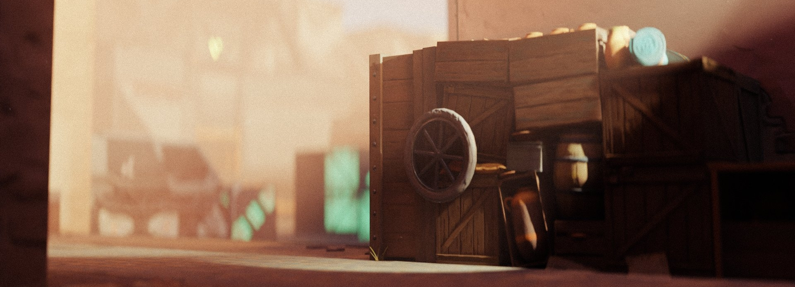

<div id="top"></div>

<br />
<div align="center">
  <a href="https://github.com/luvyana/Piana">
    
  </a>


  <p align="center">
    <br />
    <a href="discord.gg/ianas">Join our Discord Server</a>
    ·
    <a href="https://github.com/luvyana/Piana/issues">Request Feature & Report a Bug</a>
  </p>
</div>


# **Piana**
Blender addon for creating VALORANT content.


## 📒 Requirements

Before you download the addon, you must download these first.

* [.NET 6.0](https://dotnet.microsoft.com/en-us/download/dotnet/6.0) - Download the "Windows - Installer x64"
* [Blender 3.1+](https://www.blender.org/download/) - Update your Blender if it's not 3.1


## 🔧 Installation & Usage
- **[Click here to download the latest version of the addon](https://github.com/luvyana/Piana/releases)**
- Open Blender, go to Edit > Preferences > find Piana > Enable it
- Inside Piana's UI, go to Settings
   ```js
   Export Folder    = "Path to save your settings & export the maps"
                    // Pick an empty folder with a lot of space.
   PAKs Folder      = "Path to VALORANT's PAK files."
                    // ..Riot Games\VALORANT\live\ShooterGame\Content\Paks\
   ```
- **Before you do anything make sure to open console by going *"Window > Toggle System Console"***

- Now you can import maps however you want.


# ✍️ Contributing & Support

## **❤️ Support** 
[You can support me on my **Patreon**](https://www.patreon.com/luviana)

## Contribute

1. [Get this VSCode Addon](https://marketplace.visualstudio.com/items?itemName=JacquesLucke.blender-development)
2. Start VSCode **inside "src" folder**
2. CTRL + P > Start Blender
4. You'll see your changes reflected live inside Blender.


## Contact 
* Twitter : [@ogulcantokar](https://twitter.com/ogulcantokar)
* Discord : [Join my Discord](discord.gg/ianas)


## Credits

- floxay
- CoRe | Janik.M
- Rata
- Drice
- Devo
- Zertox

<p align="right">(<a href="#top">back to top</a>)</p>


